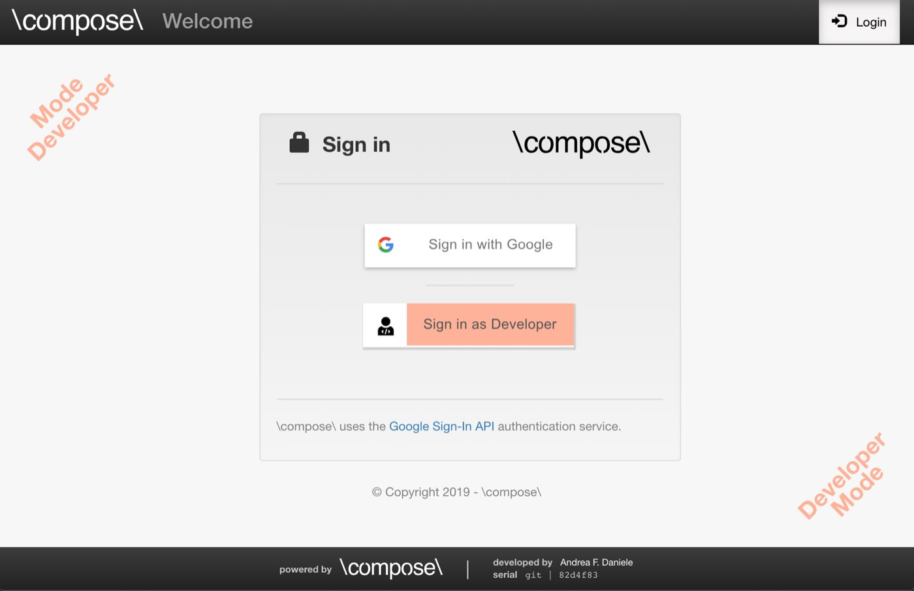

# Developer Mode

By default, **\\compose\\** uses
[Google Sign-In](https://developers.google.com/identity/) to authenticate the users.
This is very important, as it provides a high level of security when you deploy
your application.
For test or local applications, though, you can disable the login system by enabling
the **Developer Mode**.

When **\\compose\\** is in Developer Mode, the login system is disabled. This means
that everybody who has access to your application is automatically considered an
administrator of the platform.

WARN: Never deploy your application in Developer Mode. This mode is designed
for local applications and tests only.

When the Developer Mode is enabled, **\\compose\\** will show a special login button
that reads *Sign in as Developer*. You can click on it to login as administrator.
No password or authentication information will be required.

  

**\\compose\\** will notify you that the Developer Mode is enabled by adding
watermarks to the top-left and bottom-right corners of each page, as shown in the image
above. This is a safety measure and cannot be disabled.

## Safely disabling the Developer Mode

You can start developing your **\\compose\\** packages in Developer Mode and turn it off
once your application is ready for deployment.
You can turn off the Developer Mode from the **Settings** page of **\\compose\\**,
tab **General**.

WARN: Disable the Developer Mode only after you configured Google Sign-In successfully,
otherwise you will close yourself outside your own website.
If this happens, you can manually re-enable the Developer Mode by updating the file 
`COMPOSE_ROOT/public_html/system/packages/core/configuration/configuration.json`.

**\\compose\\** will disable the Developer Mode automatically after the first successful
login with Google Sign-In.
