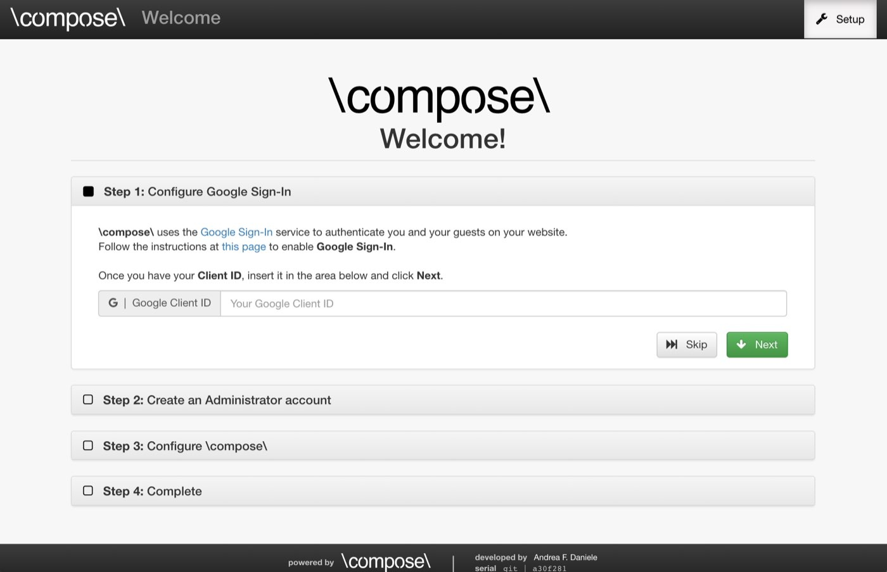
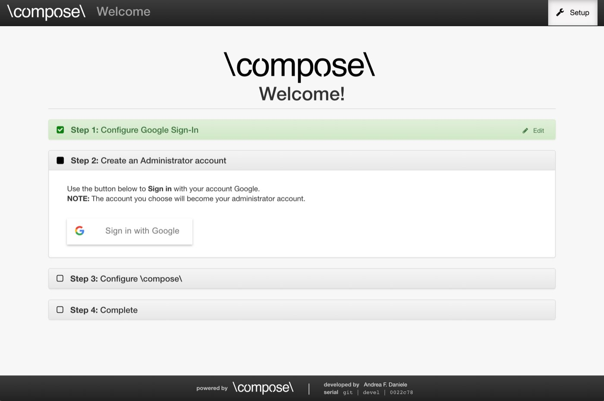
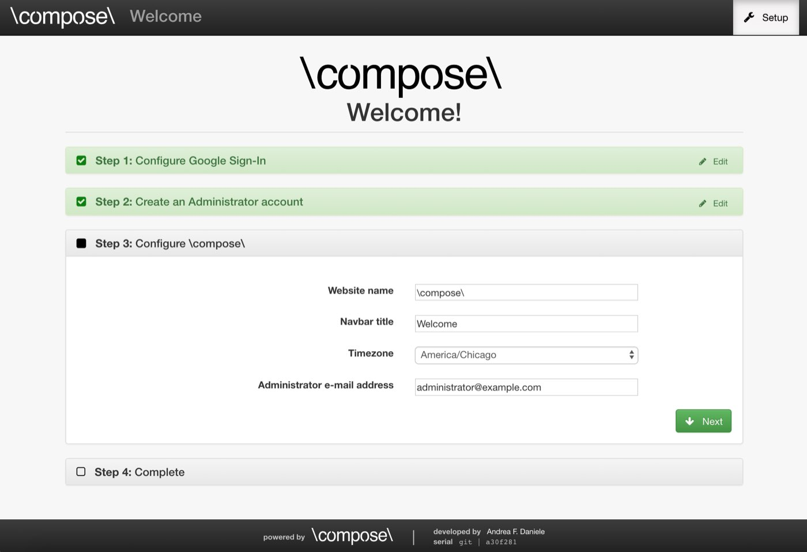
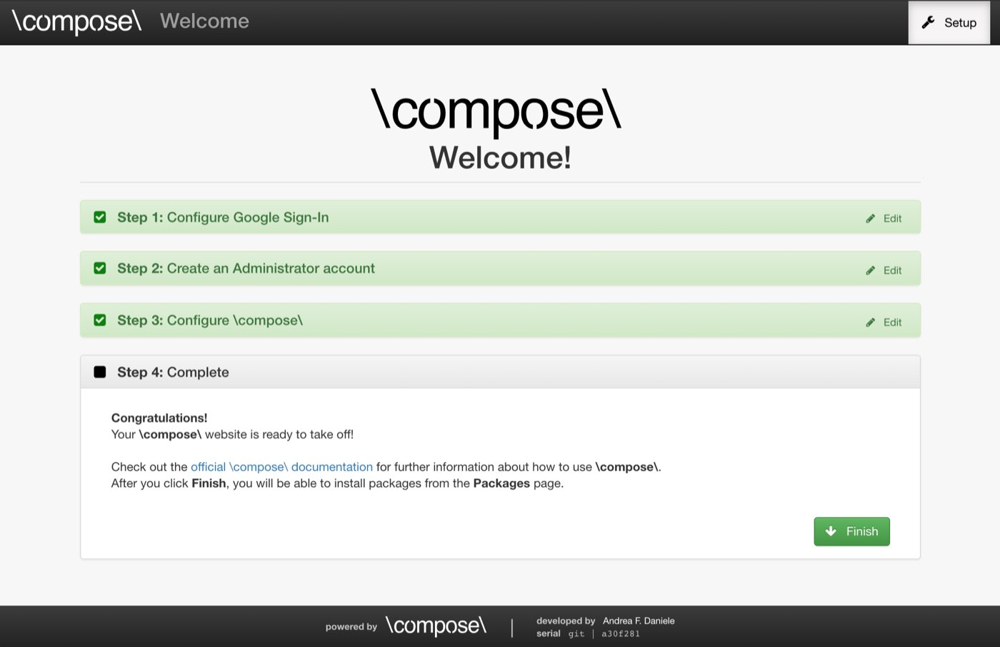

# First Setup

If everything went as planned in the previous steps, you should now be able to
access your own copy of **\\compose\\** from your browser.
You should be able to see a **Setup** page like the following.

  

## Step 1

By default, **\\compose\\** uses
[Google Sign-In](https://developers.google.com/identity/) to authenticate the users.
This is very important, as it provides a high level of security when you deploy
your application.
If this is a test or a local application, you can skip the first step.
Remember, even if you skip the first step now, you can always go back and enable
**Google Sign-In** by providing your **Google Client ID** in the **Settings** page
of your **\\compose\\** application.

WARN: If you skip the first step, everybody with access to your application will
have **administrator** privileges. It is very UNSAFE to deploy an application without
configuring Google Sign-In first.

If you want to enable **Google Sign-In**, visit
[this page](https://developers.google.com/identity/protocols/OAuth2WebServer#enable-apis)
to create a **OAuth client ID** of type **Web application**.

NOTE: Make sure that you add the URL `http://SERVER_HOSTNAME/` to the list of
**Authorized JavaScript origins** and **Authorized redirect URIs** while setting up
your Google Credentials. Do not forget that `SERVER_HOSTNAME` is simply a placeholder
and you should replace it with your server hostname, as explained during the installation
of **\\compose\\**.

## Step 2

If you skipped the first Step, you will not be asked to complete Step 2 either.

If you configured your own application on Google Sign-In, and provided the Google Client ID
in Step 1, you will see that Step 2 is now open.

  

Before you login, remember, if you have multiple Google accounts, the administrator
privileges will be associated only with the first account you login with. All the other
accounts will only have User privileges, so keep track of which account you used during
the first login.

You can go ahead and login using your Google account. This will create an administrator
account that will be associated with your Google account.

## Step 3

At this point, the **Step 3** tab should be open, as shown in the image below.

  

You can complete this step as you please.
Feel free to update all the fields, and remember, you can always update your
choices by visiting the page **Settings** of your **\\compose\\** application.

When you are happy with your choices, click on **Next**.

## Step 4

The **Step 4** tab should now be open, as shown below.
You can go ahead and click on **Finish**.

  

